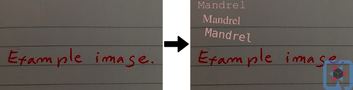

# Web service to watermark images

This quickstart demonstrates a use case for [Quarkus AWT extension](https://github.com/quarkusio/quarkus/tree/main/extensions/awt).

There is a single POST endpoint that consumes a multipart form data and returns an octet stream with a watermarked PNG image.
For the sake of brevity, regardless of the image type posted, the service always returns a PNG image.

[Quarkus AWT extension](https://github.com/quarkusio/quarkus/tree/main/extensions/awt) enables a set of ImageIO and AWT
functionality in Quarkus Native images. See the extension documentation and tests to learn the available scope.
Given the nature of native libraries in JDK implementing various image processing algorithms,
venturing outside the tested scope might result in native image build time or runtime failure.

# Additional system dependencies
Note `microdnf` command installing `fontconfig` library in [Dockerfile.jvm](./src/main/docker/Dockerfile.jvm)
and [Dockerfile.legacy-jar](./src/main/docker/Dockerfile.legacy-jar) to support jvm mode. 
Both `freetype` and `fontconfig` libraries are needed for native mode in [Dockerfile.native](./src/main/docker/Dockerfile.native).

# Usage with curl

e.g.

```bash
curl -F "image=@/tmp/my_image.jpg"  http://localhost:8080/watermark --output /tmp/result.png
```
Watermarks the given image with some text in the top left corner and a Quarkus icon in the right bottom corner.

# Usage with a client code

See [ImageResourceTest.java](./src/test/java/org/acme/awt/rest/ImageResourceTest.java). The test is executed
in native mode with:

```bash
./mvnw clean verify -Pnative
```
To run native tests locally, a JDK 11.0.13+ with Mandrel (or GraalVM) 21.3+ is required.
Additionally, `freetype-devel` and `fontconfig` libraries must be installed. 

# What the result looks like

This is an example of what this quick start does to an image:


